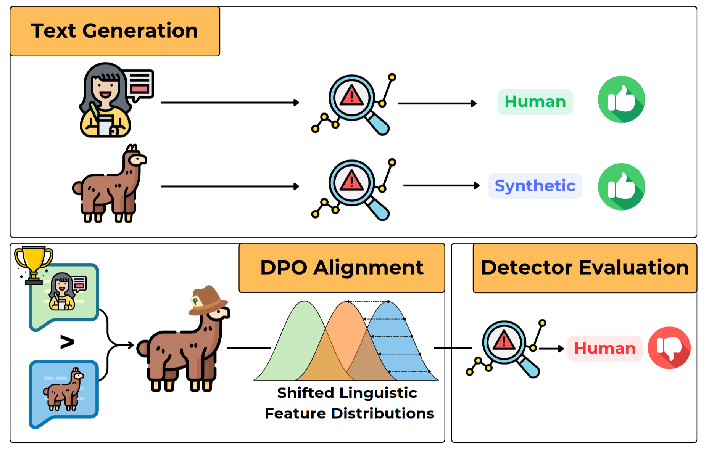

# Stress-testing Machine Generated Text Detection: Shifting Language Models Writing Style to Fool Detectors

Code for the ACL 2025 Findings paper **"Stress-testing Machine Generated Text Detection: Shifting Language Models Writing Style to Fool Detectors"** \[[ACL](https://2025.aclweb.org/)\] \[[arxiv](https://arxiv.org/abs/2505.24523)\]



# Datasets
We perform our exepriments starting from two datasets: [XSUM](https://huggingface.co/datasets/EdinburghNLP/xsum) and [M4-Abstract](). The train-test splits are stored in the [data](data) folder.

For both datasets, the adversarial datasets that we generate via the DPO fine-tuned models are stored in the [adversarial_dataset folder](dpo_dataset/adversarial_dataset).

# Workflow

1. Profile HWT and MGT texts
2. Obtain the adversarial dataset dataset
3. DPO fine-tuning of LLM generator
4. Generate new MGT with the fine tuned models
5. Evaluate Detectors
6. Repeat steps from 1 to 4 to further decrease detectors performance

# Model Fine-Tuning
All the DPO fine-tunings are performed via the [TRL](https://huggingface.co/docs/trl/index) library. In all our trainings, we leverage LoRA via the [PEFT](https://huggingface.co/docs/peft/en/index) library.

The [dpo_trainer](dpo_trainer) folder contains the code to perform any iteration of the dpo fine-tuning.

## First DPO iteration
This is an example script to perform the first round of DPO fine-tuning on 

```python
python dpo_trainer/train.py \
                --model_name "llama-3.1-8b" \
                --datapath "data/xsum/vanilla/xsum.zip" \
                --lora \
                --dataset_name "xsum-iter-1" \
                --nepochs 1 \
                --lr 5e-5 \
                --beta 1.0
```

This will save a LoRA module in the models-dpo folder, under a subfolder named `$dataset_name/$timestamp`.

## Subsequent DPO iterations
For subsquent iteration, user need to additionally provide a path to the LoRA weights obtained after the first-iteration, and select the adversarial dataset generated with the dpo-fine tuned model.
To instruction on how to obtain the adversarial dataset check out the **adversarial dataset generation** section below.
This is an example script:

```python
python dpo_trainer/train.py \
                --model_name "llama-3.1-8b" \
                --lora \
                --adapter_path "models-dpo/llama-3.1-8b_lora/xsum-iter-1/$timestamp" \
                --datapath "dpo_dataset/adversarial_dataset/xsum/llama/adversarial_dpo_dataset.json" \
                --dataset_name "xsum-iter-2" \
                --nepochs 1 \
                --lr 5e-5 \
                --beta 1.0
```


# Adversarial Dataset Generation

## DPO Fine-Tuned Generation
The [generation_code](generation_code) folder contains the code to obtain the outputs of the DPO-fine tuned models used in the adversarial datasets. Generations are computed via the [vllm](https://docs.vllm.ai/en/stable/) library. This is an example script for the llama model and the xsum dataset:

```python
python generation_code/fastgen.py \
        --datapath "data/xsum/vanilla/xsum.zip" \
        --split_path "data/xsum/splits/split.100000.json" \
        --model "meta-llama/Meta-Llama-3.1-8B-Instruct" \
        --model_name "llama-dpo-iter1" \
        --adapter_path "models-dpo/llama-3.1-8b_lora/xsum-iter-1/$timestamp" \
        --max_tokens 256 \
        --batch 10000 \
```

Generations will be stored in the [generation_code/generation](generation_code/generations) folder, in a subfolder named after the `$dataset_name/$model_name/$timestamp`.

## Profiling
Run the Profiler (TODO)

## Adversarial Dataset Generation
The [dpo_dataset/adversarial_dataset_generator.py](dpo_dataset/adversarial_dataset_generator.py) is responsible for generating the final adversarial dataset. It takes as input the generations obtained in the previous step.
This is an example script for the xsum dataset ,

```python
python dpo_dataset/adversarial_dataset_generator.py \
        --dataset_name "xsum" \
        --split_file "data/xsum/splits/split.100000.json" \
        --profile_path_mgt 'path to the profiling results of machine generated texts' \
        --profile_path_hwt 'path to the profling results of human written texts' \
        --mgt_text "generation_code/generations/xsum-iter-1/llama-dpo-iter1/0130-2348/generations-0203_1752.json" \
        --hwt_text "data/xsum/vanilla/xsum.zip" \
        --mgt_method "llama-iter-1"
        --tokenizer_name "meta-llama/Llama-3.1-8B-Instruct" \
        --max_length 256
        --epsilon 0.1
        --second_iter True/False
        --prev_svm path to previously trained SVM, iff second_iter is True
```

# Detector Evaluation
The [evaluation_code](evaluation_code) folder contains the code to pefrom the MGT Detectors evaluation.
This is an example script to evaluate MAGE:

```python
python evaluation_code/fastdetect_mage.py \
        --datapath "generation_code/generations/m4abs-naive-iter-2/gemma-dpo-iter2/0211-1226/generations-testset-0211_1652.json" \
        --max_length 256 \
        --batchsize 128 \
        --target "llama" \  
        --split_path "data/m4abs/splits/splits.20000.json"
```

# Requirements

To download the data install  `git lfs`

# Citation

If you find our code useful for your research, please cite our [paper](https://arxiv.org/abs/2505.24523):

```
@misc{pedrotti2025stresstestingMGT,
      title={Stress-testing Machine Generated Text Detection: Shifting Language Models Writing Style to Fool Detectors}, 
      author={Andrea Pedrotti and Michele Papucci and Cristiano Ciaccio and Alessio Miaschi and Giovanni Puccetti and Felice Dell'Orletta and Andrea Esuli},
      year={2025},
      eprint={2505.24523},
      archivePrefix={arXiv},
      primaryClass={cs.CL},
      url={https://arxiv.org/abs/2505.24523}, 
}